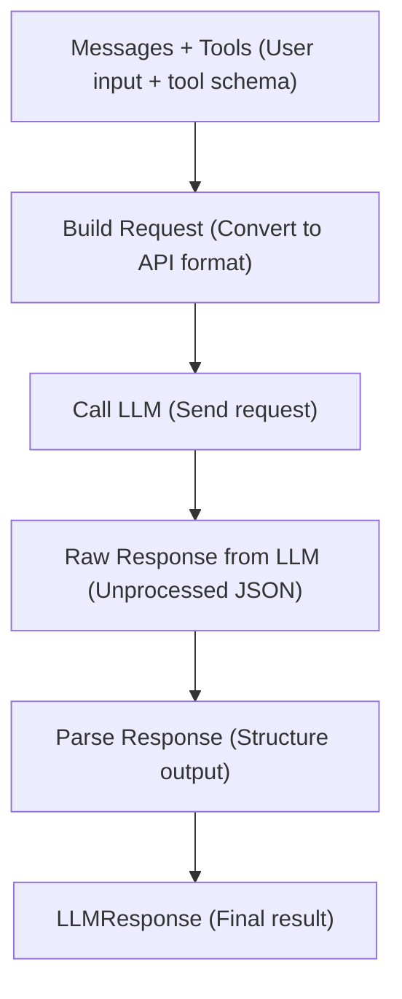

# Agent Adapters
### Basic Introduction
- Adapter is a layer which is responsible for connecting your agent to a Large language model as a provider.

### Purpose
- Each LLM providers (cloud or local) expose their api in different format and protocols.
- The **adapter** acts as a central translator allowing to interact with any model through a consistent interface.

### Structure
```python
class AgentAdapter(ABC):

    '''Public API (Don't override)'''

    async def complete(self, messages: List[Message], tools: List[dict], think: bool = False) -> LLMResponse:
    
    def complete_sync(self, messages: List[Message], tools: List[dict], think: bool=False) -> LLMResponse:
    
    
    '''Implementation Required'''
    def _build_request(self, messages: List[Message], tools: List[dict], think: bool) -> dict:

    async def _call(self, request: dict) -> Any:

    def _parse_response(self, response: Any) -> LLMResponse:    
```

### Adapter Flow


### Built-in Adapters
- Ollama Adapter

## Creating a Custom Adapter
### Introduction
- In this comprehensive guide, let's learn on how to create our own groq-api adapter from scratch.

### Aim
#### To build an adapter such that
1. We construct build payload method that the API expects us.
2. We construct a parse response method that this framework expects.

### 1. Creating the base class
- Let's create a new class that inherits from **AgentAdapter**

```python
from lily_agent.adapters.core import AgentAdapter

class GroqAdapter(AgentAdapter):
    pass
```

### 2. Understanding the Endpoint
- Provides an endpoint similar to **OpenAI-compatible Chat completion**. It follows the same request & response structure used by **OpenAI**
- The Groq API endpoint is
```bash
https://api.groq.com/openai/v1/chat/completions
```
This part is the base_endpoint url
```bash
https://api.groq.com/openai
```
This part is the path url
```bash
v1/chat/completions
```

### 3. Setting up the constructor
- We will set up
    - The default endpoint of Groq
    - Creating an httpx network client
```python
def __init__(
    self, model: str, 
    base_endpoint: str | None = None,
    path: str | None = None, 
    api_key: str | None = None,  
    timeout: float = 300.0,
    **kwargs
) -> None:

    base_endpoint = base_endpoint or "https://api.groq.com/openai" # Base Endpoint.
    path = path or "/v1/chat/completions"  # Chat completion route

    super().__init__(model, base_endpoint, path ,api_key, timeout ,**kwargs)
```

### 4. Understanding the request payload
- The type of request payload that groq expects from us is
**Without any tools defined**
```json
{
  "model": "llm-model-name",
  "messages": [
    {"role": "system", "content": "You are a helpful assistant"},
    {"role": "user", "content": "Hello!"}
  ]
}
```
**With tools defined**
```json
{
  "model": "llm-model-name",
  "messages": [
    {"role": "user", "content": "What's the weather today?"}
  ],
  "tools": [],
  "tool_choice": "auto"
}
```

### 5. Inheriting the _build_request
- Override the _build_request method to start building payloads for the Groq API
- This payload takes in list of messages and list of tools (if passed) and converts into API-Compatible format.
> [!WARNING]
> Groq does not support a native "thinking" parameter It instead supports temperature parameter.
```python

from typing import Dict, Any, List, Optional
import json

def _build_request(self, messages: List[Message], tools: List[dict], think: bool) -> dict:
    '''Start by creating a list of messages''' 
    messages_list: List[dict] = []

    '''Iterate through all the messages one by one'''
    for message in messages:
        '''Get the content of the message'''
        message_content = message.content
        

        '''If message content is actually a tool call result then let's convert it to json'''
        if isinstance(message_content, (dict, list)):
            message_content = json.dumps(message_content)


        '''Let's create a new dictionary per message'''
        messages_mapped: Dict[str, Any] = {
            "content": message_content
        } 

        '''If the message contains a role which is a tool_result, then we set the map role => tool.  Else we set the default role that we got from the agent.'''
        if message.role == "tool_result":
            messages_mapped["role"] = "tool"
            if message.tool_call_id:
                messages_mapped["tool_call_id"] = message.tool_call_id
        else:
            messages_mapped["role"] = message.role
                
        messages_list.append(messages_mapped)

    '''Let's finalise the payload and return it.'''
    request = {
        "model": self.model,
        "messages": messages_list,
    }

    '''If we have tools on our agent, lets add an key-value Pair'''
    if tools:
        request["tools"] = tools
        request["tool_choice"] = "auto" # Expected by the api.

    '''Convert thinking to temperature.'''
    if think:
        request["temperature"] = 0.2

    return request
```

### Example response output from the Groq Api
- Normal text response (identified by finish_reason: stop)
```json
{
  "id": "chatcmpl-f51b2cd2-bef7-417e-964e-a08f0b513c22",
  "object": "chat.completion",
  "created": 1730241104,
  "model": "openai/gpt-oss-20b",
  "choices": [
    {
      "index": 0,
      "message": {
        "role": "assistant",
        "content": ""
      },
      "logprobs": null,
      "finish_reason": "stop"
    }
  ],
  "usage": {
    "queue_time": 0.037493756,
    "prompt_tokens": 18,
    "prompt_time": 0.000680594,
    "completion_tokens": 556,
    "completion_time": 0.463333333,
    "total_tokens": 574,
    "total_time": 0.464013927
  },
  "system_fingerprint": "fp_179b0f92c9",
  "x_groq": { "id": "req_01jbd6g2qdfw2adyrt2az8hz4w" }
}
```

- Tool Call Response (identified by finish_reason: tool_calls)
```json
{
  "id": "chatcmpl-f51b2cd2-bef7-417e-964e-a08f0b513c22",
  "object": "chat.completion",
  "created": 1730241104,
  "model": "model-name",
  "choices": [
    {
      "index": 0,
      "message": {
        "role": "assistant",
        "content": null,
        "tool_calls": [
          {
            "id": "call_abc123",
            "type": "function",
            "function": {
              "name": "function-name",
              "arguments": "{\"key\":\"value\"}"
            }
          }
        ]
      },
      "finish_reason": "tool_calls"
    }
  ]
}
```


### 6. Understanding the response that Lily expects
- Lily agent framework expects an **LLMResponse** as the response output.
- A quick overview of what **LLMResponse** Contains
  - **response_type** (can be either text or tool_call)
  - **content** (message content)
  - **tool_calls** (any tool calls requests generated by the model)
  - **raw** (raw response directly passed from the api)

### 7. Inheriting the _parse_response method.
- Let's start constructing the _parse_response method.

```python
from lily_agent.adapters.core.adapter_classes import LLMResponse, ToolCall
from lily_agent.adapters.core.adapter_exceptions import AdapterError
import json

def _parse_response(self, response: Any) -> LLMResponse:

    '''Getting the choices dictionary from the response'''
    choices = response.get("choices", [])

    '''If there is no choices returned by the api then Let's raise an exception'''
    if not choices:
        raise AdapterError("No choices returned from Groq response")

    '''Let's extract the first message and it's contents from choices'''
    message = choices[0].get("message", {})
    content = message.get("content", None)

    '''Define an empty list of tool_calls that the agent expects'''
    tool_calls: List[ToolCall] = []

    '''We will retrive the tool_calls that the LLM returned in the response'''
    raw_tool_calls = message.get("tool_calls")

    if raw_tool_calls: # If there is a tool_call requested by the LLM
        '''We iterate through the tool call to get expected parameters to build ToolCall'''
        for tool_call in raw_tool_calls:
            function: Optional[Dict] = tool_call.get("function")
            if function is None:
                raise AdapterError("Tool call missing 'function'")

            tool_call_id: str = tool_call.get("id") # ID Generated by the LLM
            '''Getting the function name from the dictionary'''
            tool_name: Optional[str] = function.get("name") 

            if tool_name is None:
                raise AdapterError("Tool call missing 'name'")

            '''Getting the arguments of the function extracted by the LLM'''
            arguments = function.get("arguments", "{}")
            tool_arguments = json.loads(arguments)

            '''Append the request tool_call to the dict'''
            tool_calls.append(
                ToolCall(
                    id=tool_call_id,
                    name=tool_name,
                    input=tool_arguments
                )
            )

        '''We return an LLMResponse with the type=tool_call and all the parameters extracted'''

        return LLMResponse(
            response_type="tool_call",
            content=content,
            tool_calls=tool_calls,
            raw=response
        )

    '''Default Fallback finish_reason = stop'''    
    return LLMResponse(
        response_type="text",
        content=content,
        tool_calls=None,
        raw=response
    )
```

### 8. Final Implementation.
- Here is the [final code implementation](../../examples/adapters/groq_adapter.py) that you can refer.