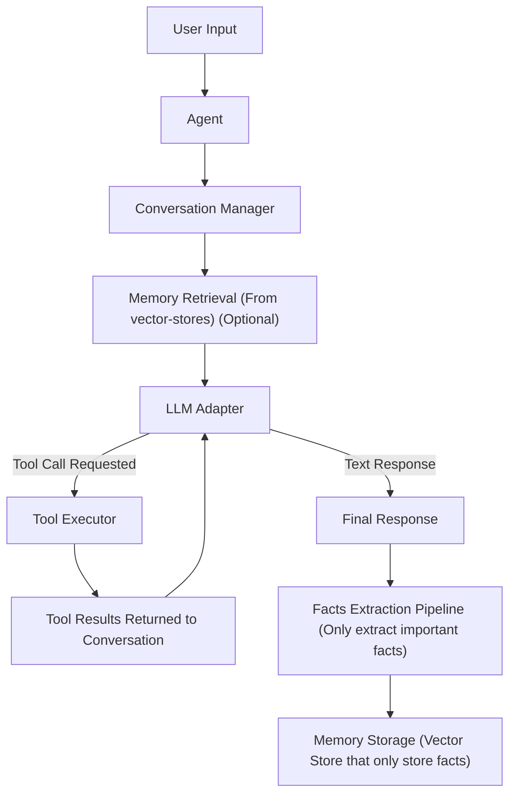

# Agents
- Agents are the core of the framework.  
- They manage interactions between LLM, users, orchestrate tools, Memory, Policies and Event systems.
- Agents coordinate reasoning, tool execution, conversational history, and persistent memory. 

## Agent Architecture Overview

## Agent Base
- Every Agents within the framework are inherited from [AgentBase](../../src/lily_agent/agents/core/agent_base.py)
- Agent base is an abstraction class which defines the essential parameters and shared behaviors required for any operational agent.
    - **adapter**: `AgentAdapter`
    - **name**: `str`
    - **key**: `str`
    - **role**: `str`
    - **prompt**: `str`
- These parameters are required for all agents to functional

### Core Components
- **adapter**: `AgentAdapter`
  - layer which is responsible for connecting your agent to a Large language model as a provider.
- **name**: `str`
  - Name of the agent
- **key**: `str`
  - Unique human readable key that defines the agent.
-  **role**: `str`
   - Defines the specilization or identity of an agent in a single sentence
- **prompt**: `str`
    - Prompt that describes what the agent does, or what it is responsible for
## Lily Agent
- Lily Agent is an agent-class which is inherited from `AgentBase`
- It extends the base Agent class with features such as
  - **tools**: `List[Tool]`
  - **formatter**: `Formatter`, 
  - **memory**: `MemoryBase`,
  - **policy**: `AgentPolicy`,
  - **registry**: `AgentRegistry`,

### Core Components
- **tools**: `Optional[List[Tool]]`
    - Defines the collection of tools that the agent can request **tool-calls** for.
- **formatter**: `Optional[Formatter]`
    - Responsible for converting tool schemas into LLM compatible formats.
    - By default it is set to [BaseFormatter](../../src/lily_agent/formatters/base_formatter.py)
- **memory**: `Optional[MemoryBase]`,
   - Provides persistent vector-store memory.
   - Supports push (insert), retrieval, delete, update, clear.
- **policy**: `Optional[AgentPolicy]`
   - Controls agent runtime behavior.
- **registry**: `AgentRegistry`,
   - Registers agent metadata for persistence and tracking (agent_id, system_prompt, user_id)
   - This registry is used efficiently on Multi-Agent Systems.


## Creating Agents
- An agent requires an [AgentAdapter](../adapters/adapters.md) to interact with an LLM.  There are some pre-made adapters available.
- For this guide let's use the OLLAMA Adapter that comes with the framework

### Synchronous Agent.
```python
from lily_agent import LilyAgent

agent = LilyAgent(
    adapter=OllamaAdapter(model="qwen2.5:7b"),
    name="Lily", # Give your agent a human readable name
    role="An kind and supportive agent", # One liner of your prompt. 
    prompt="You are a kind and supportive agent who helps user with tasks.  You can request for tool calls whenever necessary", # A detailed description
    key="general_agent", # An Unique Key that is used on multi-agent orchestration
    max_iter=10,
    policy=policy, # Agent Policy
    registry=registry, # Agent Registry (defaults to json by default)
    memory=memory # Agent Memory layer.
)

response = agent.run_sync(input("Enter a prompt: > "))
print(response)
```

### Asynchronous Agent.
```python
from lily_agent import LilyAgent

import asyncio

agent = LilyAgent(
    adapter=OllamaAdapter(model="qwen2.5:7b"),
    name="Lily", # Give your agent a human readable name
    role="An kind and supportive agent", # One liner of your prompt. 
    prompt="You are a kind and supportive agent who helps user with tasks.  You can request for tool calls whenever necessary", # A detailed description
    key="general_agent", # An Unique Key that is used on multi-agent orchestration
    max_iter=10,
    policy=policy, # Agent Policy
    registry=registry, # Agent Registry (defaults to json by default)
    memory=memory # Agent Memory layer.
)

async def main():
    response = await agent.run(input("Enter a prompt: > "))
    print(response)

asyncio.run(main())
```

### Agents with Memory and registry
- Let us define an agent with Persistent Vector store.  Please refer [Agent Memory]() guide to implement your custom Memory vector store.
- Also refer [AgentRegistry]() to implement a pre-defined agent registry or create a custom registry 

#### Understanding FactRetriever
- A fact retriever agent is inherited from AgentBase.  It's a predefined agent that retrieves only important fact.
- A fact retriever agent also requires an adapter.  We will use the same model as an fact retriever.  However it is recommended to use a different low parameter model.
- An workflow contains using different adapters (Cloud model for main agent, Local low parameter model for extracting facts )

#### Understanding Embedder
- embedder is an abstract class which defines the embed method used for embedding text into vector embeddings.  
- for this example we use an OllamaEmbedder (inherited from `Embedder`) which implements the method **embed**

### Implementation
```python
memory = await AgentMemory.create(
        # Define an adapter
        llm=FactRetriever(
            adapter=OllamaAdapter(model="qwen2.5:7b"),
        ),
        # An embedding model to convert text to vector-embedding
        embedder = OllamaEmbedder(
            model="all-minilm:33m",
            dimensions=384
        ),
        # Vector Store (Example LanceDB)
        vector_store=Lance,
        uri="database/memory" # Vector Store Parameters
)

""" Using the memory """
agent = LilyAgent(
    adapter=OllamaAdapter(model="qwen2.5:7b"),
    name="Lily", # Give your agent a human readable name
    role="An kind and supportive agent", # One liner of your prompt. 
    prompt="You are a kind and supportive agent who helps user with tasks.  You can request for tool calls whenever necessary", # A detailed description
    key="general_agent", # An Unique Key that is used on multi-agent orchestration
    max_iter=10,
    memory=memory # Agent Memory layer.
)

print(agent.run_sync(input("Enter a prompt: > ")))
```

### Agents with Policy
- An agent policy controls agent runtime behavior.
- A policy is just a dataclass that contains boolean information that can be used to toggle in-toggle off agent runtime behavior
- Some of the policy are
  - use_tools
  - use_conversational_history
  - use_memory
  - store_memory

#### Core Components
- **use_tools**: `bool`
   - Enables or disables tool execution entirely.
- **use_conversational_history**: `bool`
   - Enables or disables the prior conversational history.  When disabled, each query is stateless.
- **use_memory**: `bool`
   - Enables or disables retrieval from persistent **vector store**
- **store_memory**: `bool`
   - Enables or disables whether an information is persisted or not.

### Implementation
```python
from lily_agent.policy import AgentPolicy

""" Defining an agent Policy """
""" Stateless behavior, Only retrieve from persistent vector store """
policy = AgentPolicy(
    use_tools=True,
    use_conversational_history=False,
    use_memory=True,
    store_memory=True
)

""" Using the policy """
agent = LilyAgent(
    adapter=OllamaAdapter(model="qwen2.5:7b"),
    name="Lily", # Give your agent a human readable name
    role="An kind and supportive agent", # One liner of your prompt. 
    prompt="You are a kind and supportive agent who helps user with tasks.  You can request for tool calls whenever necessary", # A detailed description
    key="general_agent", # An Unique Key that is used on multi-agent orchestration
    max_iter=10,
    policy=policy # Agent Policy.,
    memory=memory
)
```
